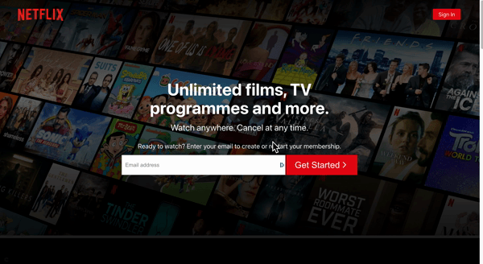

# Netflix ( React-dom )

> A responsive and dynamic Netflix web app built with React, Firebase & SCSS.
> Live demo [_here_](https://netflix-react-dom.netlify.app/).
>
> This project is ongoing, features and placeholder items will changed or expanded on.
> 
> email: andrew@admin.dev
> 
> password: 123456

## Table of Contents

- [General Info](#general-information)
- [Technologies Used](#technologies-used)
- [Lessons Learned](#Lessons-learned)
- [MVP](#MVP)
- [Additional Features](#Additional-Features)
- [Screenshots](#screenshots)
- [Setup](#setup)
- [Project Status](#project-status)
- [Acknowledgements](#acknowledgements)
- [Contact](#contact)

## General Information

- I decided to build a clone of Netflix as it gave me a UI design I could visualise and build the UI myself and turn it into working code. I could also inspect elements and compare how they went about building the UI. 
- I used firebase for its minimal setup and easy access to data and auth, allowing me to get more confident working end to end using react. I followed the Firebase DOCS building this out, I will most likely follow a brief overview tutorial of firebase to clear some things up as I found it a bit tricky finding some info in the DOCS.
- This project gave me more exposure to different hooks ( useEffect, useContext, useReducer ) and custom hooks ( useFetch )
- I hit my MVP so I decided to deploy the project, I will continue to work on it as there is plenty of features I will and want to add ( media carosel, media queries and Jest testing ). I will work and improve features as time goes on.
I will build things outside the scope of this project and implement the newer features once I’ve spent time learning them.


## Technologies Used

- [React](https://reactjs.org/) - version 17.0.2
- [Firebase](https://firebase.google.com/) - version 9
- [React](https://reactrouterdotcom.fly.dev/docs/en/v6) - version 17.0.2
- [Axios](https://www.npmjs.com/package/axios) - version 0.27.2
- [Scss](https://sass-lang.com/) - version 1.49.9

## Lessons Learned

- Custom hooks ( useFetch ) extracting fetch logic needed to fetch the data and passing a url variable to the useFetch hook, allowing multiple components to fetch data using the same logic
- useEffect on data fetching, updating the DOM and timers. Understanding the dependancy array, if absent running every time the component it rendered, if empty running once, adding dependence variables will run the effect again if the variable state changes and cleanup functions.  
- useReducers and React Context
- Typography, planning, time management and time contsraints

## Screenshots

<!--  -->

## MVP

- The app should resemble Netflix UI design
- The app should allow the user to login / create a profile ( email )
- The user should be able to add and remove liked movies
- The app should display the users favorite specific to the user logged in.

## Additional Features

- Impliment testing ( Jest )
- The user can query search by name or genre
- The user can edit account and avatar
- The user can select and play movies
- The user can make subscribe using a payment system

## Screenshots

#### Home Page



#### Browse Page


#### Featured Film


## Setup

```
npm install
```

```
npm start
```

Runs the app in the development mode.

Open http://localhost:3000 to view it in the browser.

## Project Status

Project is: _In Development_

## Acknowledgements

- This project was based on [Netflix](https://www.netflix.com/gb/).
- The project API used [TMDB](https://www.themoviedb.org/).

## Contact

Created by [drewpeattie@hotmail.com](mailto:drewpeattie@hotmail.com) - feel free to contact me!
